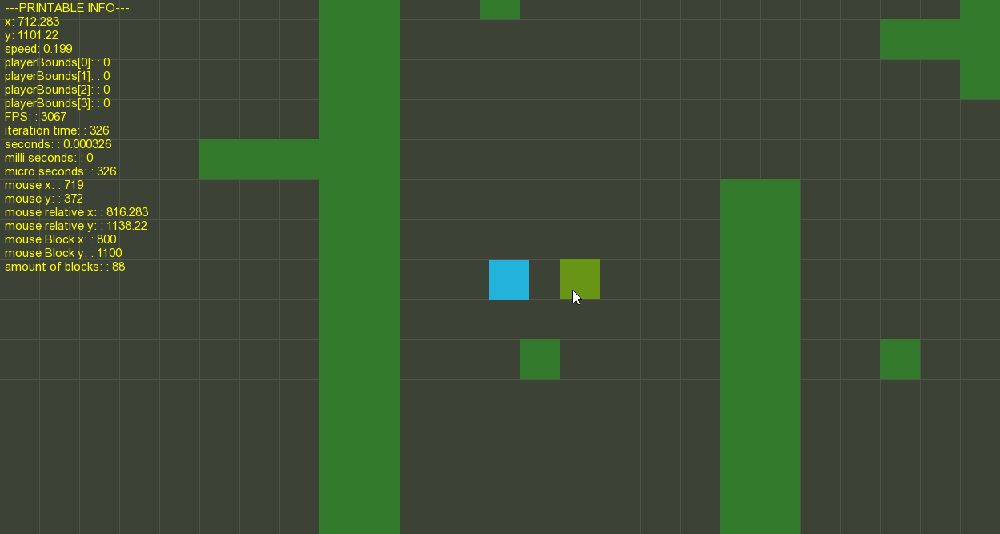

# 2DCollision
SFML Box Collision Game Project

Written in C++ using SFML library. The purpose of the project is to understand
how entities created in a game environment detect collisions with boxes and cannot move through these boxes. This was an introduction to developing 2D Game Engines.

